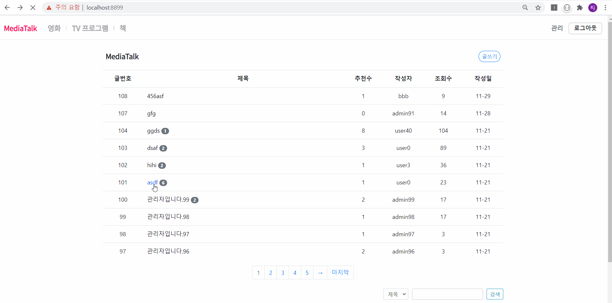

# MediaTalk 

스프링부트 JPA로 작업한 프로젝트입니다. 

Spring boot JPA+Jdk 1.8+Bootstrap4.0+Tomcat+MySQL+JSP 

기본 블로그형 사이트에 SSL, 스프링 시큐리티와 OAuth2.0을 적용하여 회원가입과 로그인이 진행되도록 했습니다. 필수요소인 게시판, 댓글을 연습하면서 더욱 빠르고 최적화된 포맷으로 완성하는 것이 목표였습니다. 
 
 
+ JQuery Validation Plugin과 구글 리캡챠를 사용하여 회원가입

 
 
+ 구글 아이디로 로그인, 페이스북 아이디로 로그인: DB에서 아이디를 조회한 후 없으면 자동 회원가입 진행합니다.

 
 
+ 글쓰기: 글쓰기는 회원만 할 수 있습니다. 로그인후 생기는 principal 객체를 조회하여 강제로 로그인을 진행하도록 합니다.

 
 
+ 글수정 및 삭제: 썸머노트 라이브러리를 적용하였습니다.

 
 
+ 댓글 쓰기 및 삭제: 자신의 댓글만 삭제할 수 있습니다.

 
 
+ 추천: 추천은 동일 ID일 경우 게시물당 한번만 할 수 있습니다.

 
 
+ 검색과 페이징: 스프링부트의 Pageable과 부트스트랩 Pagination을 적용하였습니다.

 
 
+ 관리자 페이지: 회원정보 수정 및 삭제가 가능합니다. 페이징과 검색을 처리할 수 있습니다.

 
 
+ 박스오피스 API: 영화진흥위원회의 박스오피스 API로 순위와 영화제목을 조회. 영화진흥위원회 영화 상세정보 API로 영어제목과 국가 조회. 한국영상자료원 KMDB의 상세정보 API로 이미지와 url 주소 조회.

 
 
+ TV프로그램 API: TMDB API 사용하여 국내외 인기 TV프로그램 조회

 
 
+ 책 API: 인터파크 도서 베스트셀러 API 사용

